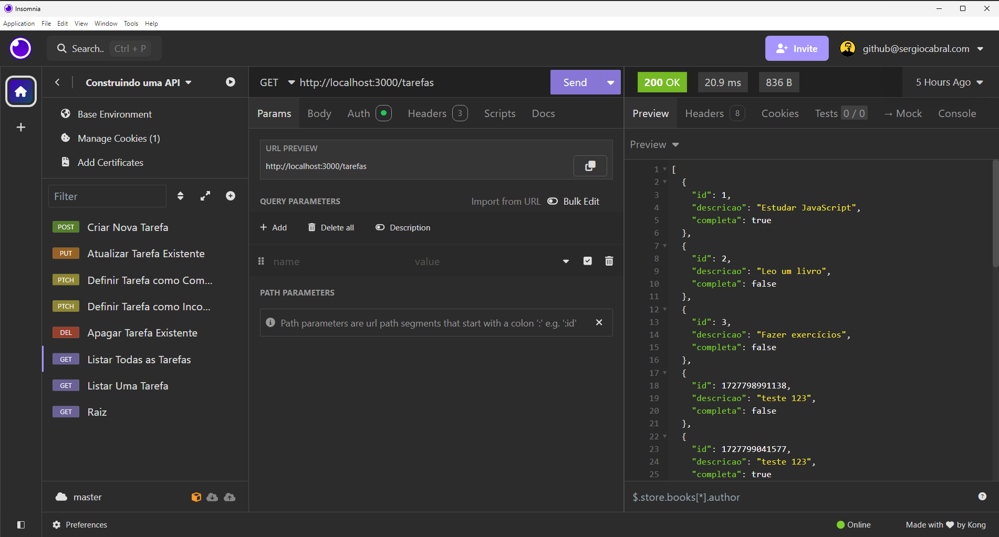

# API de Tarefas

Esta é uma API simples de gerenciamento de tarefas construída em **Node.js** com **Express**. Ela permite criar, atualizar, listar e excluir tarefas. A autenticação é feita via **GitHub**.



## Funcionalidades

- Listar todas as tarefas
- Listar uma tarefa específica
- Criar nova tarefa
- Atualizar tarefa existente
- Definir tarefa como completa ou incompleta
- Apagar tarefa

## Como rodar o projeto

Instale as dependências:
```bash
npm install
```

Crie um arquivo `env.json` com as suas configurações:
```javascript
{
  "authRedirect": "/usuario",
  "sessionSecret": "SESSION_SECRET",
  "corsOrigin": "http://localhost:3000,http://localhost:8080",
  "githubClientID": "YOUR_GITHUB_CLIENT_ID",
  "githubClientSecret": "YOUR_GITHUB_CLIENT_SECRET",
  "githubCallbackURL": "http://localhost:3000/auth/github/callback"
}

```

Inicie a aplicação:
```bash
npm start
```

A API estará rodando em `http://localhost:3000`.

## Endpoints

| Método  | Endpoint              | Descrição                         |
| ------- | --------------------- | --------------------------------- |
| GET     | `/tarefas`             | Lista todas as tarefas           |
| GET     | `/tarefa/:id`          | Lista uma tarefa específica      |
| POST    | `/tarefa`              | Cria uma nova tarefa             |
| PUT     | `/tarefa/:id`          | Atualiza uma tarefa existente    |
| PATCH   | `/tarefa/:id/completa` | Define tarefa como completa      |
| PATCH   | `/tarefa/:id/incompleta` | Define tarefa como incompleta  |
| DELETE  | `/tarefa/:id`          | Apaga uma tarefa                 |

## Autenticação

A API usa autenticação via **GitHub OAuth**. Para acessar a maioria dos endpoints, o usuário deve estar autenticado com uma conta GitHub.

### Exemplo de uso

Aqui está um exemplo de uma interface frontend que utiliza essa API para gerenciar tarefas:


https://github.com/sergiocabral/Sample.JavaScript.TodoList.Frontend

O frontend foi construído separadamente e se conecta à API via chamadas HTTP.
